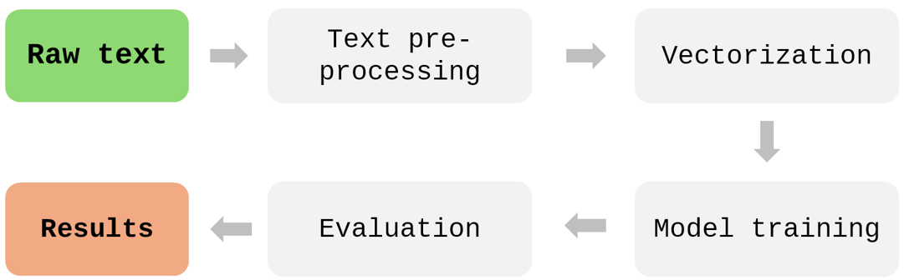

# Model approach
The example of pipeline:

{fig-align="center" width="60%"}

# Pre-processing
We began by preprocessing the collected web data, which included cleaning the text,
removing special characters, normalising the content, and stripping HTML tags. We then converted all text
to lowercase. Digits and special characters were removed as well, since they usually do not contribute
to the classification task. We also used regular expressions to filter out phone numbers
and email addresses and ensured that any confidential information was removed.

# Bielik – Polish Language Model
In the next stage of the work, the approach to processing text collected from company websites was revised.
Instead of relying on traditional cleaning and preprocessing techniques, we adopted a method
based on the Polish language model Bielik‑1.5B‑v3.0‑Instruct (Mistral), which enables effective
handling of raw textual data. The model not only supports summarisation but also handles text translation,
which is particularly important when working with multilingual data. As a result,
it was possible to standardise the input data without relying on additional translation tools.
Using prompt‑engineering techniques, the model was applied to generate concise summaries of long
and often unstructured content extracted from websites. This approach significantly simplified
the data‑processing pipeline by eliminating the need for traditional NLP methods such as removing
named entities, stemming or lemmatisation. The adopted solution reduced data‑preparation time
and lowered the overall complexity of the process.

It is worth noting that, due to its size and open‑source nature, Bielik could be run locally on the Statistics Poland server, ensuring that no sensitive data was shared externally.

# Vectorization
The text was transformed into numerical representations using vectorisation methods.
These representations were used as input for model training.

# Models and machine learning
The models are evaluated using standard metrics such as accuracy, precision, and recall.
We tested both traditional machine learning algorithms (decision trees, random forests
and logistic regression) and XLM‑RoBERTa (XLM‑R), a multilingual language model
based on the Transformer architecture, fine‑tuned on NACE‑related data from Norway and Denmark.
To optimise performance, we applied hyperparameter tuning. We used GridSearchCV with three‑fold
cross‑validation, systematically testing multiple parameter combinations for each model.
This allowed us to identify the best configuration for both the machine learning models and XLM‑RoBERTa.

