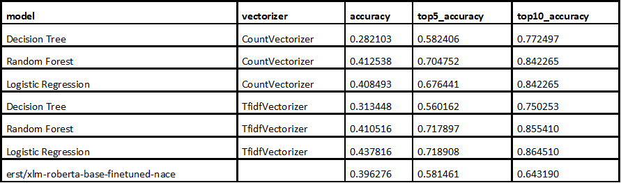
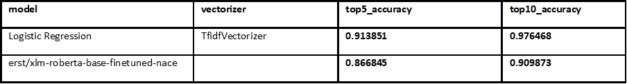
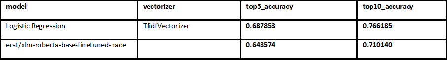

# Results with web data

The best result was achieved using logistic regression combined with TF‑IDF, which also delivered
the highest accuracy. This may be due to the fact that, for the dataset analysed, the relationships
between features and labels are largely linear, which favours models such as logistic regression.
In addition, the TF‑IDF representation effectively captured the key textual information without
introducing unnecessary model complexity.

# Results with web data and synthetic data
After retraining the model using both the data collected from company websites and the newly generated
synthetic data, we observed very high effectiveness in predicting the two‑digit NACE code.
Both the Top‑5 and Top‑10 accuracy increased to a high and stable level, confirming
the benefits of enriching the dataset.

Encouraged by these results, we repeated the entire pipeline for the four‑digit codes — that is,
data balancing, enriching the dataset with synthetic samples, and training the models.
However, due to the much larger number of classes and the higher level of detail,
the outcomes were less satisfactory. As expected, the task proved to be significantly more complex,
and although the Top‑5 and Top‑10 results remained at an acceptable level,
they are clearly lower than in the case of the two‑digit classification.

