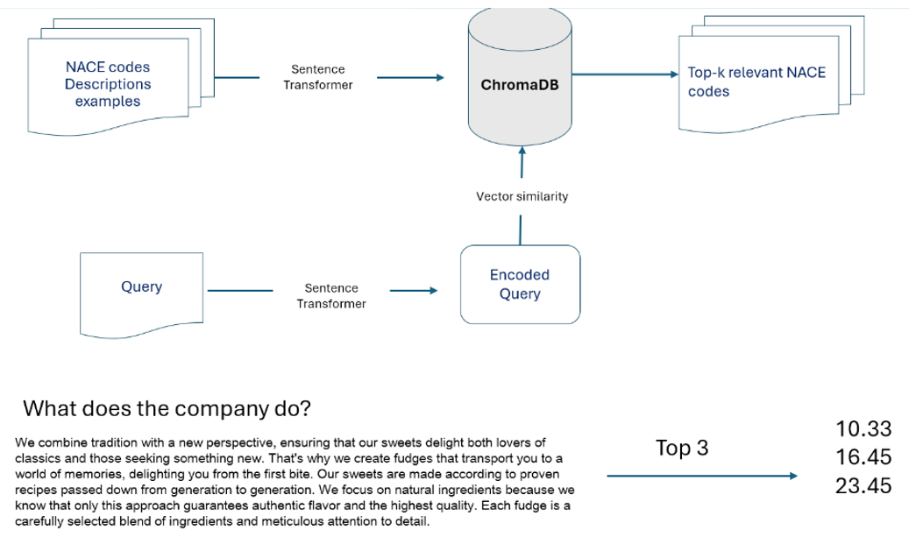

# Current research

We are currently implementing the RAG technique with an LLM in our pipeline.
All relevant sources (documents describing PKD codes and website descriptions) have been stored
in the ChromaDB vector database.

{fig-align="center" width="100%"}

At the same time, we are testing the LoRA (Low‑Rank Adaptation) method,
which will allow us to adapt the LLM to our specific use case.